# Task 4: Cloud Security Implementation using AWS
📌 Objective To implement cloud security best practices by configuring IAM policies, secure storage, and data encryption on AWS.

_________________________________________________________________________________________________________________________________
☁️ Cloud Platform Used

Amazon Web Services (AWS)
IAM (Identity and Access Management)
Amazon S3
EC2 (Access validation testing)

_________________________________________________________________________________________________________________________________
1️⃣ IAM Policy Implementation

🎯 Goal Apply the principle of least privilege by restricting user permissions.

🔧 Implementation

Created an IAM user with limited permissions.
Did NOT assign administrative access.
Restricted S3 access to prevent unauthorized operations.
Tested access denial scenarios.

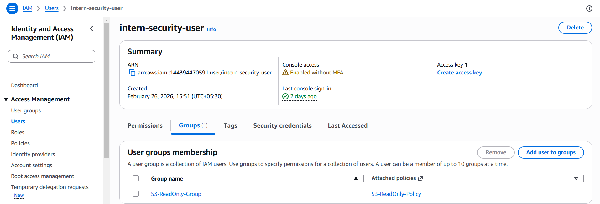

_________________________________________________________________________________________________________________________________
2️⃣ Secure Storage using Amazon S3

🎯 Goal Ensure storage bucket is secure and not publicly accessible.

🔧 Implementation

Created an S3 bucket.
Blocked all public access.
Uploaded multiple test objects.

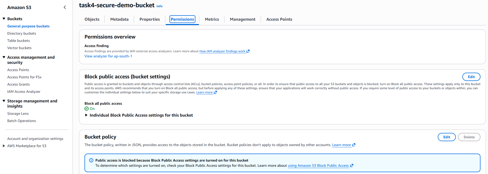

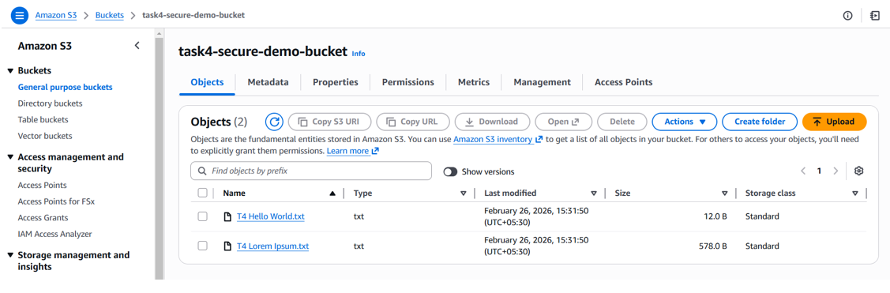

_________________________________________________________________________________________________________________________________
3️⃣ Data Encryption (Encryption at Rest)

🎯 Goal Protect stored data using server-side encryption.

🔧 Implementation

Enabled default encryption on the S3 bucket.
Used SSE-S3 (AES-256) encryption.
Verified encryption status for each object.

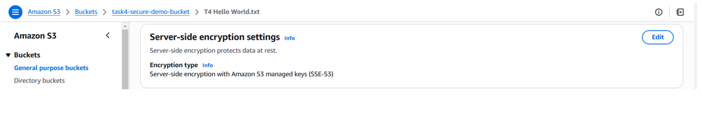

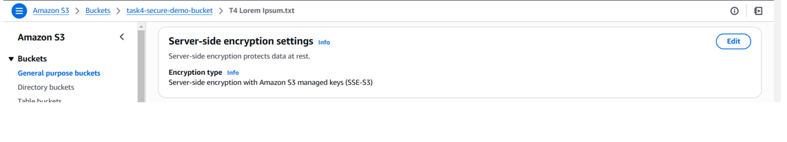

_________________________________________________________________________________________________________________________________
4️⃣ Access Control Validation (Security Testing)

To verify security controls, multiple access attempts were tested:

❌ Attempt 1: IAM User Delete Object

User attempted to delete an object.
Operation was denied.

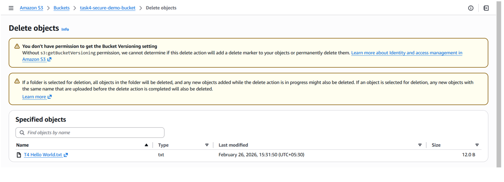

_________________________________________________________________________________________________________________________________
❌ Attempt 2: IAM User Access S3

User attempted to access S3 bucket.
Access was denied due to restricted permissions.

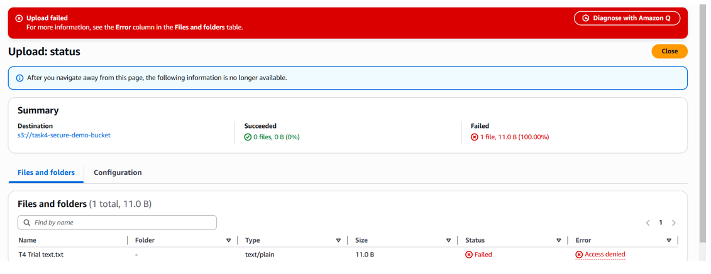

_________________________________________________________________________________________________________________________________
❌ Attempt 3: EC2 Instance & IAM Dashboard Access

Attempted to access S3 from EC2.
Access denied due to IAM restrictions.

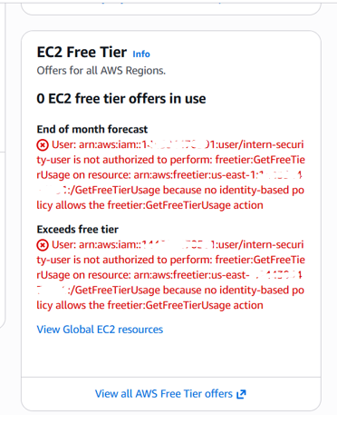

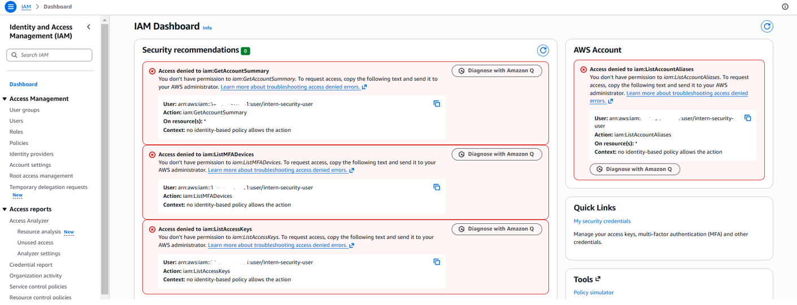

_________________________________________________________________________________________________________________________________
❌ Attempt 4: Public Access (Incognito Mode)

Bucket URL accessed in incognito browser.
Access denied confirmed.
Public access successfully blocked.

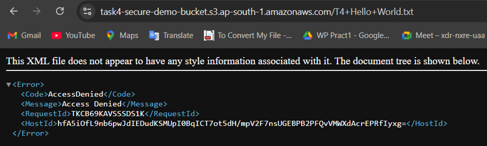

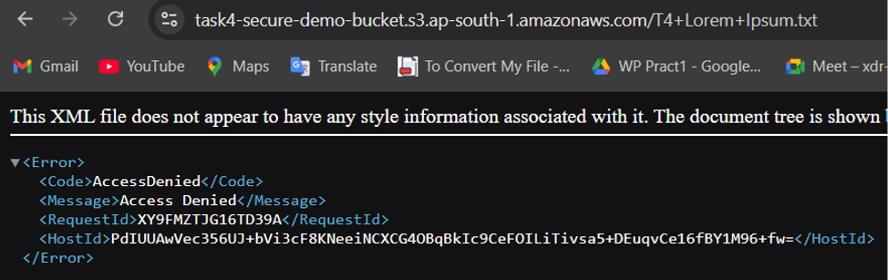

_________________________________________________________________________________________________________________________________
5️⃣ Versioning Enabled

🎯 Goal Protect against accidental deletion or overwriting of files.

🔧 Implementation

Enabled versioning on the S3 bucket.
Verified multiple versions of objects.

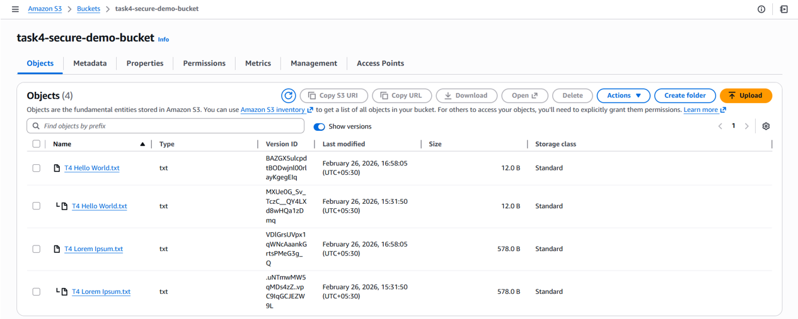

_________________________________________________________________________________________________________________________________
📊 Results

The cloud storage environment was successfully secured by:

Implementing IAM-based access control
Blocking public access
Enforcing encryption at rest
Validating restricted permissions
Enabling versioning for data protection
All unauthorized access attempts were denied, confirming effective security configuration.

_________________________________________________________________________________________________________________________________
✅ Conclusion

This task demonstrates practical implementation of cloud security principles using AWS. By applying IAM restrictions, secure storage configurations, encryption, and versioning, the cloud environment was protected against unauthorized access and data loss.
